# Blush Beauty
This project is for a custom website for a full-service beauty salon. Priority will be given to having a classic-looking portfolio, along with scheduling capabilities for a large team of stylists.
## Website Pages
* Home [Done]
* About
* Contact
* Services [Done]
* Gallery [Done]
* Portfolio
* Reviews [Done]
* Community
* Blog
## Color Scheme
* --blush: #E9BEBE;
* --gray: #7D7474;
* --mint: #D1EFE4;
* --slate: #BBBBBB;
* --dust: #EEEEEE;
## Technology
The following will be used for this project:
* HTML
* Custom CSS
* Bootstrap CSS
* Bootstrap JavaScript
* Custom JavaScript
* Git
* Visual Studio Code
* WebStorm
## Current Status
Design and development started on 01-30-2024. 
The following pages are completed for desktop 
and mobile screens:
* Homepage
* Service Menu
* Gallery
* Reviews
## Screenshots
_Note: Repeated content on webpages not shown._
### Homepage (Desktop)

### Homepage (Mobile)
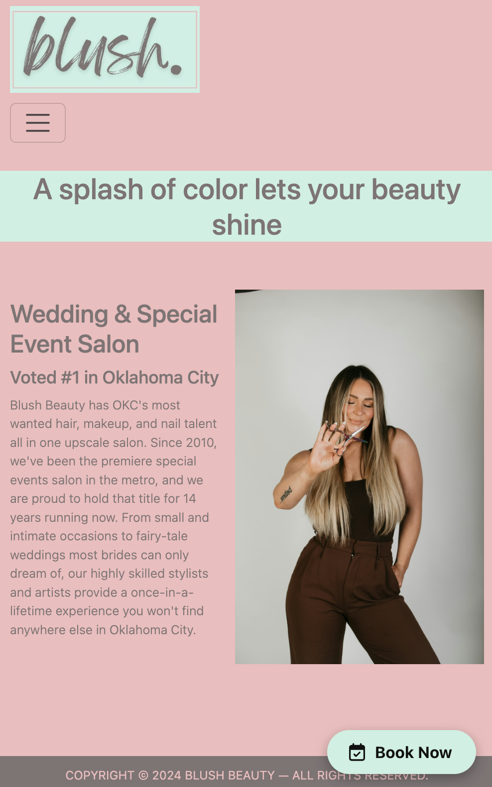

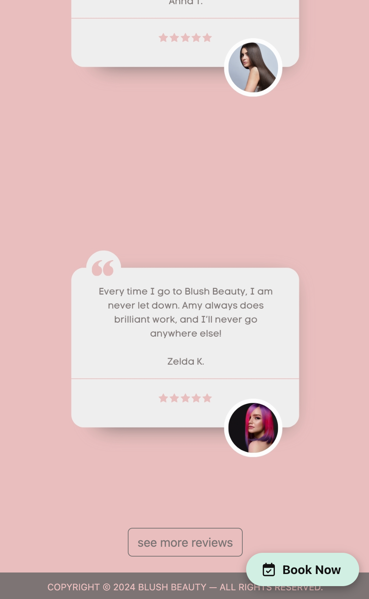
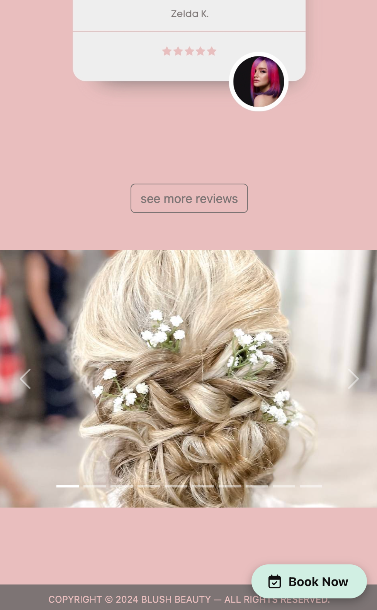
### Booking Widget (Desktop)

### Booking Widget (Mobile)
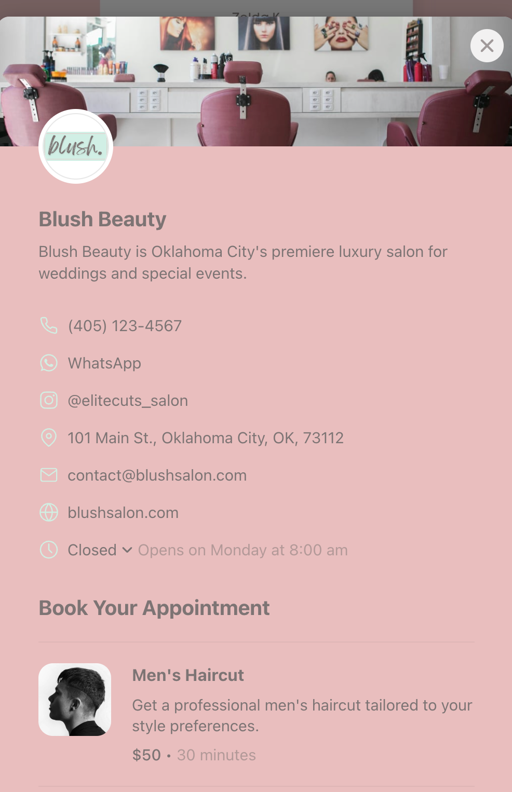
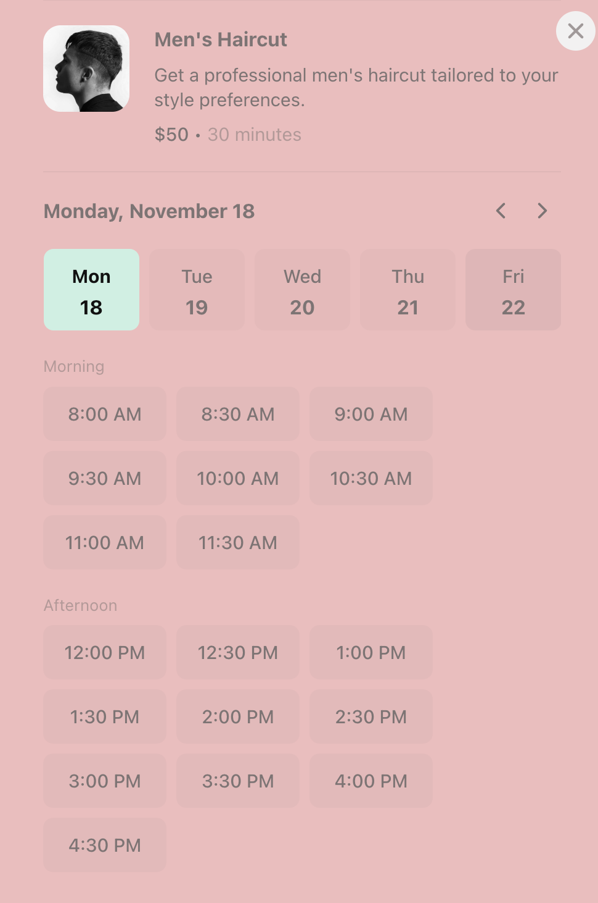
### Service Menu (Desktop)
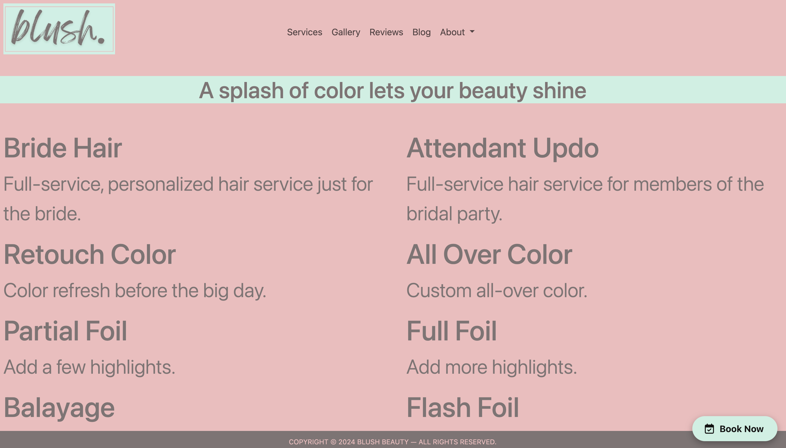
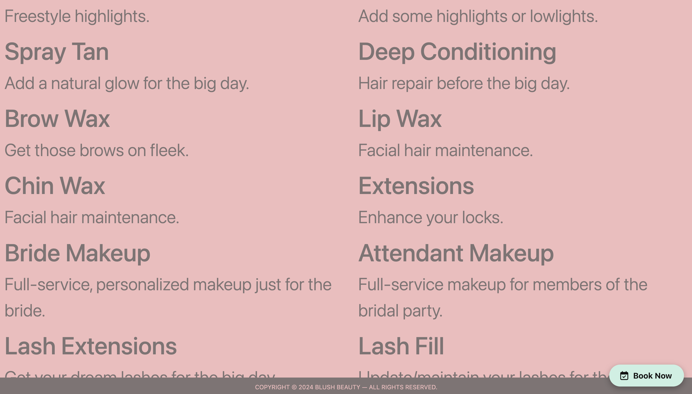
### Service Menu (Mobile)
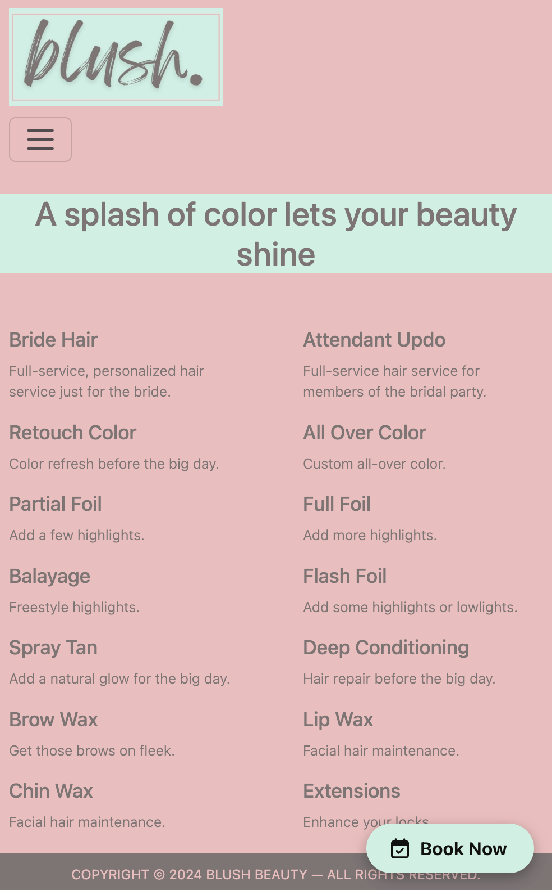
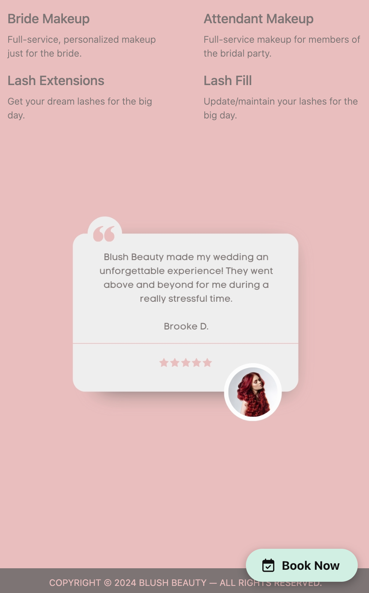
### Gallery (Desktop)

### Gallery (Mobile)
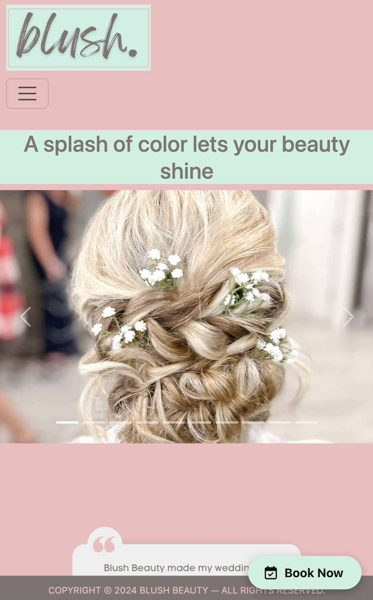
### Reviews (Desktop)
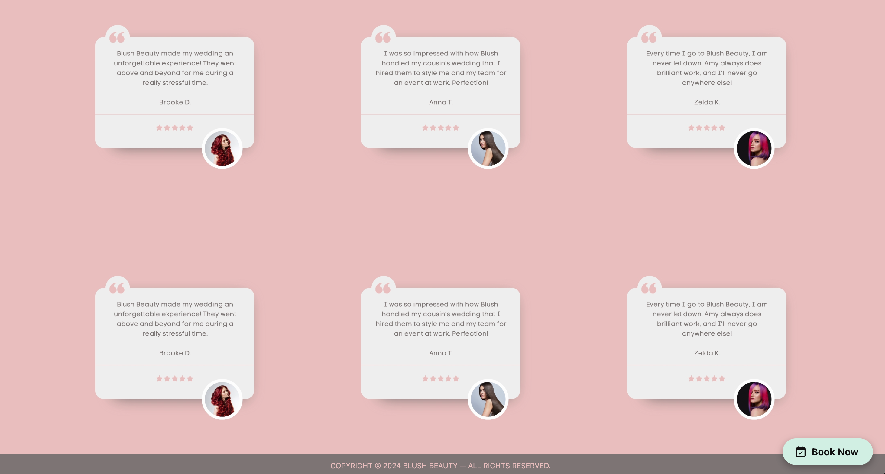
### Reviews (Mobile)
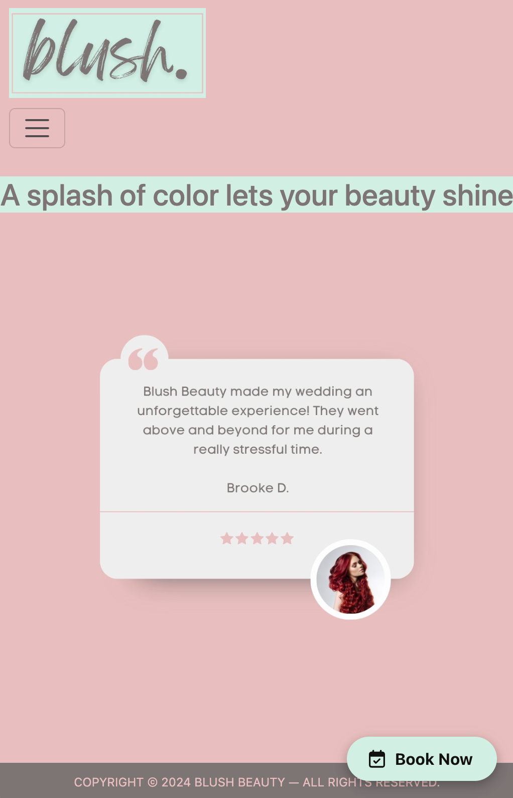