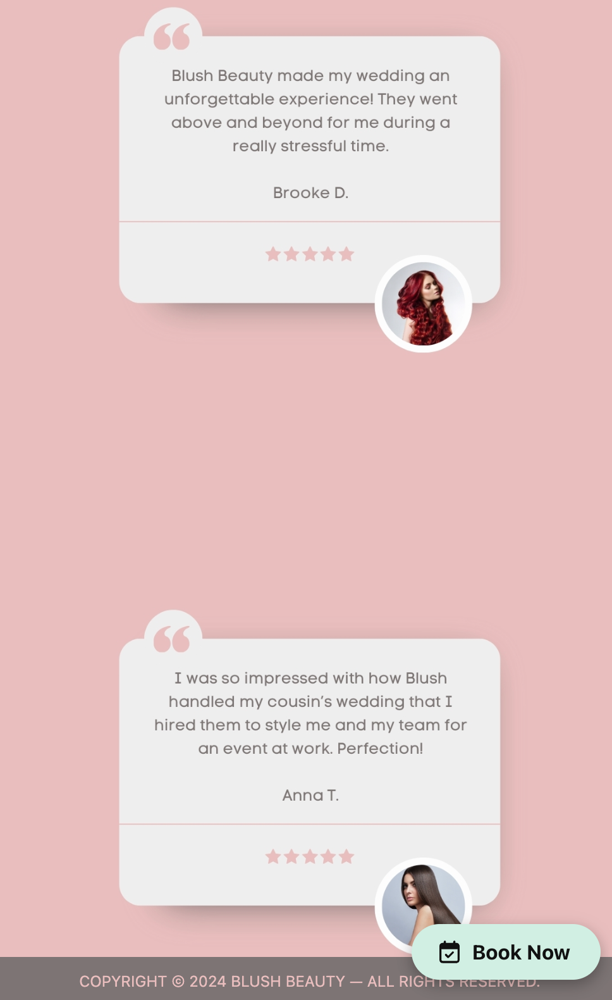

# Blush Beauty
This project is for a custom website for a full-service beauty salon. Priority will be given to having a classic-looking portfolio, along with scheduling capabilities for a large team of stylists.
## Website Pages
* Home
* About
* Contact
* Services / Pricing
* Portfolio
* Reviews
* Community
* Blog
## Color Scheme
* --blush: #E9BEBE;
* --gray: #7D7474;
* --mint: #D1EFE4;
* --slate: #BBBBBB;
* --dust: #EEEEEE;
## Technology
The following will be used for this project:
* HTML
* Custom CSS
* Bootstrap CSS
* Bootstrap JavaScript
* Custom JavaScript
## Current Status
Design and development started on 01-30-2024. Desktop homepage is complete. Working on mobile 
homepage.
## Screenshots
### Homepage (Desktop)

### Homepage (Mobile)

### Booking Widget (Desktop)

### Booking Widget (Mobile)

